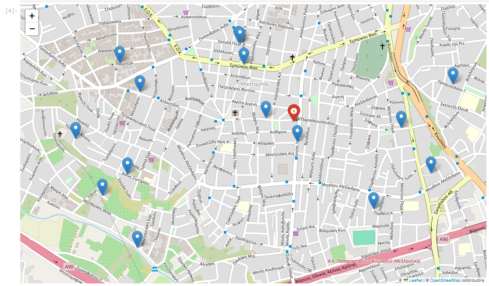
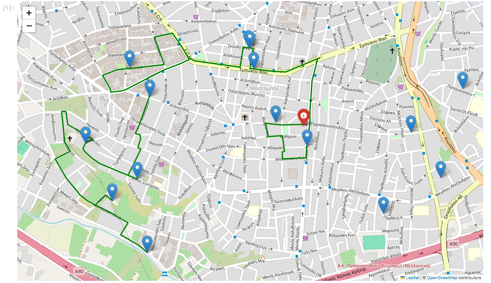
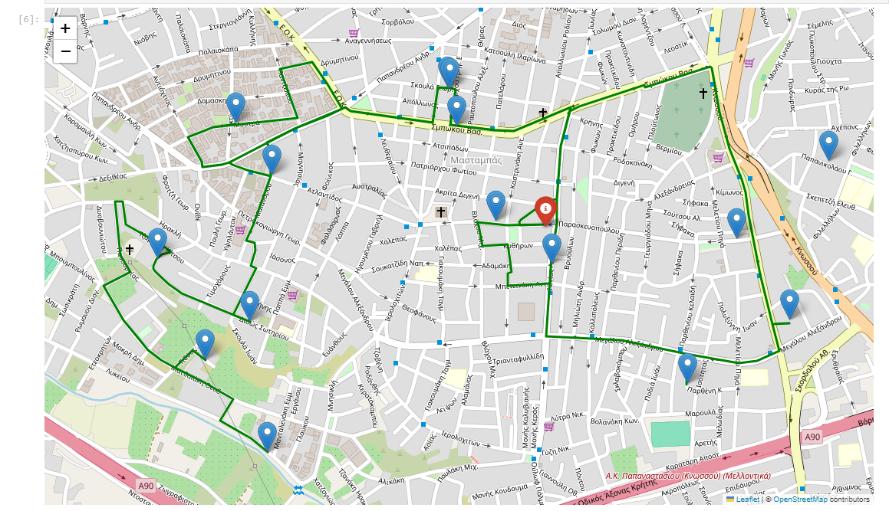

# Vehicle Route Optimization with OpenRouteService

## 📑 Overview
This project explores the **Vehicle Routing Problem (VRP)**: how to assign and sequence delivery points efficiently to minimize travel cost.  
Using **OpenRouteService (ORS)** for routing and **Folium** for interactive visualization, we demonstrate how optimization techniques can improve logistics in an urban setting.

---

## Objectives
- Parse delivery addresses from a structured dataset (Excel).  
- Compute feasible delivery routes given constraints (vehicle/day).  
- Visualize optimized routes on interactive maps.  
- Compare routing alternatives and highlight efficiency gains.  

---

## Methodology
1. **Data Input**  
   - Delivery points are read from `Interview_Programmers_OptiSolio.xlsx`.  
   - Each point has latitude/longitude and metadata.  

2. **Route Computation**  
   - ORS API computes travel distances and times between points.  
   - Candidate routes are generated and refined based on problem constraints.  

3. **Optimization Goal**  
   - Minimize **total travel distance** (proxy for cost and time).  
   - Ensure each location is visited exactly once.  

4. **Visualization**  
   - Routes are plotted with **Folium**.  
   - Outputs saved as maps (`map1.png`, `map2.png`, `map3.png`).  

---

## Results

### Example Delivery Points

  

### Optimized Route (Scenario 1)

  

### Optimized Route (Scenario 2)

  

**Key Insight:**  
- Optimization reduced redundant loops and shortened total travel distance.  
- Efficient routing allows more deliveries per day and reduces operational costs.  

